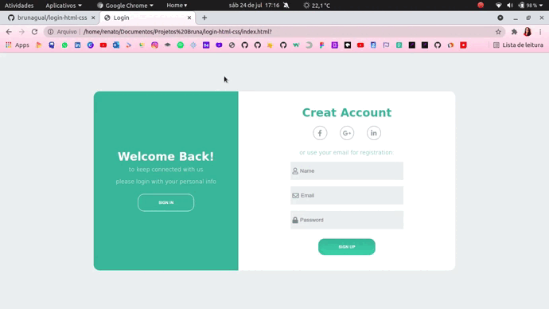

<h1 align="center"> :desktop_computer: Demonstração </h1>

***
### :mag: Sobre  
Projeto realizado para práticar a construção de sites com HTML e CSS.  
Este site representa uma página de login concomitantemente com uma página de cadastro que se sobrepõe através de *Animação CSS*, 
com botões funcionais e formulários que possuem efeito *placeholder*.  

***
### :mag: About  
Project carried out to practice building websites with HTML and CSS.  
This site represents a login page concurrently with a registration page that overlaps through *CSS animation*,
with functional buttons and forms that have *placeholder* effect.  

***
### :hammer_and_wrench: Ferramentas Utilizadas | Tools Used  
- <code></code>
- <code></code>
- <code></code>

***
### :ballot_box_with_check: Funcionalidades | Features
- [x] Cadastro do usuário - User registration  
- [x] Acesso do usuário - User login  
- [x] Recuperação de senha - Password recovery  
- [x] Acesso com as Redes Sociais - Access with social media

***
### :arrow_forward: Executando a aplicação | Using the application  
   
    # Clone o repositório
    $ git clone https://github.com/brunagual/login-html-css.git

    # Entre no diretório da aplicação
    $ cd login-html-css

    # Instale as dependências
    $ npm install

    # Inicie o website
    npm start
